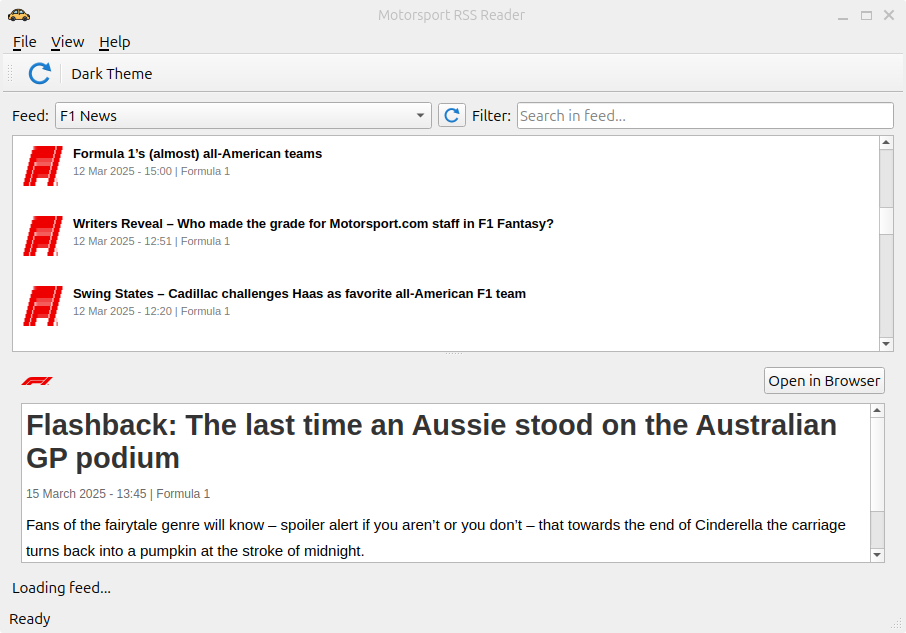

# QT-Based Motorsport RSS Reader

A modern RSS feed reader specifically designed for motorsport enthusiasts, built with Qt.

## Features

- Dark theme optimized for motorsport content
- Multiple feed support (Formula 1, MotoGP, NASCAR, WRC, etc.)
- Feed categorization and filtering
- Article saving and sharing
- Offline reading with caching
- Desktop notifications for new articles
- Cross-platform: Linux, Windows, and macOS compatibility

## Screenshots



## Installation

### Linux

#### Debian/Ubuntu

```bash
sudo dpkg -i motorsportrss_1.0.0_amd64.deb
```

#### AppImage

```bash
chmod +x MotorsportRSS-x86_64.AppImage
./MotorsportRSS-x86_64.AppImage
```

### Windows

Download and run the installer from the releases page or follow the build instructions in `build_windows.sh`.

## Building from Source

### Requirements

- Qt 5.15.2 or newer
- Qt SVG, Network, and XML modules
- C++11 compatible compiler

### Linux

```bash
qmake
make
./MotorsportRSS
```

### Windows

See `build_windows.sh` for detailed instructions on building for Windows.

## License

This project is licensed under the MIT License - see the LICENSE.txt file for details.

## Credits

- Created by KrishGaur1354
